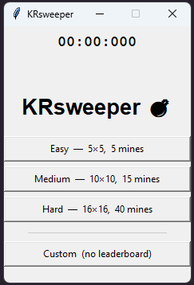
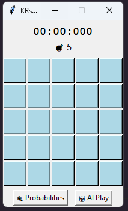
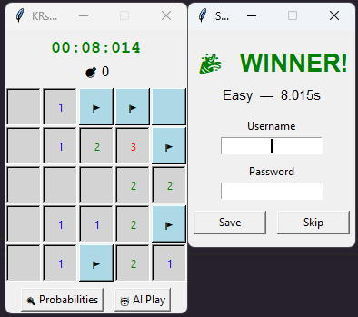
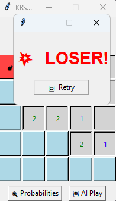
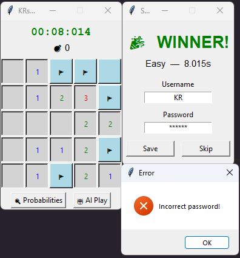
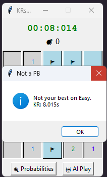
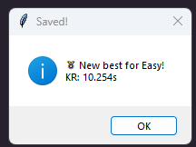
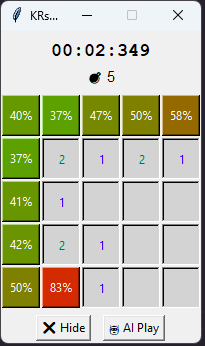
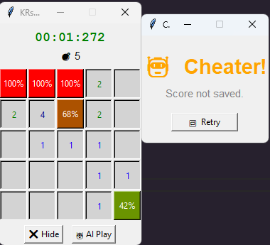

# KRsweeper 💣

OOP 2026 coursework project - Minesweeper game with an AI solver, built in Python using Tkinter.

> ⓘ *AI was used in this project. Generation Then Comprehension strategy.*

---

## 1. Introduction

### What is this application?

KRsweeper is a classic Minesweeper game with additional features: difficulty presets, a timer, a leaderboard with password-protected scores, and an AI solver that calculates mine probabilities and suggests the safest move.

### How to run the program

**Option 1: Pre-built executable (no Python needed)**

Download the `.exe` from the [KRsweeper Releases](https://github.com/Kradauskas/KRsweeper/releases/tag/release) page and run it directly.

**Option 2: Run from source**

```bash
git clone https://github.com/Kradauskas/KRsweeper.git
cd KRsweeper
python main.py
```

> Requires Python 3.10+. If `python` doesn't work, try `python3`.

> Optionally create a virtual environment first: `python -m venv venv` then activate it.

### How to use the program

- **Left click** - reveal a tile
- **Right click** - place or remove a flag 🚩
- **Probabilities** - show the estimated probability of each hidden tile being a mine (green = safe, red = dangerous)
- **AI Play** - automatically reveals the tile with the lowest mine probability

On win, you are prompted to enter a username and password to save your time to the leaderboard.

> ⚠ **Do not use real passwords** - they are stored as plaintext in `scores.json`.

---

## 2. Body / Analysis

### OOP Pillars

#### Encapsulation

Private attributes are prefixed with `_` to signal they should not be accessed directly from outside the class. Public access is provided through methods only.

```python
class Player(GameEntity):
    def __init__(self, name):
        self._name = name        # private
        self._alive = True       # private
        self._flags_placed = 0   # private

    def get_name(self):
        return self._name        # controlled access
```

#### Abstraction

The abstract base class `GameEntity` defines a shared interface for all game entities. Any class that inherits from it must implement `get_status()` and `reset()`. This hides internal complexity behind a consistent contract.

```python
from abc import ABC, abstractmethod

class GameEntity(ABC):
    def __init__(self, name):
        self._name = name
        self._status = "active"

    @abstractmethod
    def get_status(self): pass

    @abstractmethod
    def reset(self): pass
```

#### Inheritance

`Player`, `Scoring`, and `Solver` all inherit from `GameEntity`. They reuse the `_name` and `_status` attributes and override the abstract methods with their own logic.

```python
class Player(GameEntity):
    def get_status(self):
        return "Alive" if self._alive else "Dead"

    def reset(self):
        self._alive = True
        self._flags_placed = 0
        self._status = "active"
```

#### Polymorphism

Each subclass implements `get_status()` differently, but they can all be called the same way. This is used in `Minesweeper`, which holds a list of all entities and can call `reset()` on all of them without knowing their specific type.

```python
self._entities = [self._player, self._scoring, self._solver]

# In new_game():
for entity in self._entities:
    entity.reset()  # each class does its own reset
```

---

### Design Pattern: Factory Method

`GameEntityFactory` centralises the creation of all game entities. Instead of creating `Player`, `Scoring`, and `Solver` directly in `Minesweeper`, the factory handles instantiation. This makes it easy to swap implementations or add new entity types without modifying the game logic.

```python
class GameEntityFactory:
    @staticmethod
    def create_all():
        return (
            GameEntityFactory.create("player"),
            GameEntityFactory.create("scoring"),
            GameEntityFactory.create("solver"),
        )
```

The Factory pattern was chosen over Singleton because the game may need multiple independent instances (e.g., future multiplayer support), and over Builder because the objects have simple constructors.

---

### Composition and Aggregation

`Minesweeper` uses **composition**: it owns `Player`, `Scoring`, and `Solver` objects - they are created together with the game and reset when a new game starts. The `_entities` list demonstrates this - `Minesweeper` manages the lifecycle of all three.

`App` (the UI class in `main.py`) uses **aggregation**: it holds a reference to `Minesweeper` but does not control its internal lifecycle directly - it only calls its public methods (`click`, `flag`, `new_game`, etc.).

---

### File Reading and Writing

Scores are saved to and loaded from `scores.json`. The `Scoring` class handles both operations:

```python
def _load(self):
    if os.path.exists(self._scores_file):
        with open(self._scores_file, "r") as f:
            return json.load(f)
    return {}

def _save(self, data):
    with open(self._scores_file, "w") as f:
        json.dump(data, f, indent=4)
```

---

### Testing

Core functionality is covered with `unittest`. Tests are grouped by class: `TestPlayer`, `TestScoring`, `TestSolver`, `TestFactory`.

```bash
python -m unittest tests.py
```

Example test:

```python
def test_die_and_reset(self):
    self.player.die()
    self.assertEqual(self.player.get_status(), "Dead")
    self.player.reset()
    self.assertEqual(self.player.get_status(), "Alive")
```

---

## 3. Results and Summary

### Results

- The game is fully playable with all planned features implemented: difficulty presets, timer, leaderboard, AI solver, and probability overlay.
- The codebase was refactored multiple times - from procedural code to a single class, then to a proper multi-class OOP structure with all four pillars.
- The AI solver works well on open boards but can still hit a mine in forced-guess situations, which is expected behaviour in Minesweeper.
- Password storage in plaintext was a conscious trade-off for simplicity - a future version should use hashing.
- Writing unit tests revealed a subtle bug in `_check_win()` that was not caught during manual testing.

### Conclusions

KRsweeper started as a simple script and evolved into a structured OOP project with a factory pattern, abstract base class, file persistence, and an AI solver. The main result is a working, packaged Minesweeper game that demonstrates all four OOP pillars in a practical context.

**Future extensions:**
- Hash passwords in `scores.json`
- Add keyboard shortcuts
- Improve the AI solver with full constraint propagation
- Add sound effects

---

## Screenshots

### 🚀 Launch Screen
<p align="center"></p>

Four options: three difficulty presets and a custom grid builder.

---

### 🎮 Gameplay
<p align="center"></p>

Reveal tiles, avoid mines. Right-click to flag. Numbers show adjacent mine counts in standard Minesweeper colours (1=blue, 2=green, 3=red…).

---

### 🏆 Winning
<p align="center"></p>

On win, enter a username and password to save your time to the leaderboard.

---

### ❌ Losing
<p align="center"></p>

Triggered when you click on a mine.

---

### 💾 Save Failed / ✅ Save Success / 🥇 New Best
<p align="center">
  
  
  
</p>

---

### 📈 Probabilities & 🧠 AI
<p align="center">
  
</p>

Green = safe, red = dangerous. **AI Play** picks the lowest-probability tile automatically. Using either feature marks the run as a cheat and disables leaderboard saving.

<p align="center"></p>

---

## Development Timeline

| Period | Work done |
|--------|-----------|
| Feb 10-15 | Initial Minesweeper logic, no classes |
| Feb 15-17 | Simple UI with Tkinter |
| Mar 10-13 | Rewrote into a single class |
| Apr 15 | Split into `GameEntity`, `Player`, `Minesweeper` |
| Apr 17 | English function names, mine colours, timer, leaderboard |
| Apr 18 | All planned features complete |
| Apr 19-22 | Final polish |

---

## Known Limitations

- AI can still hit a mine in forced-guess situations
- `scores.json` could get corrupted if the app crashes mid-write
- Passwords are stored as plaintext - do not use real passwords
